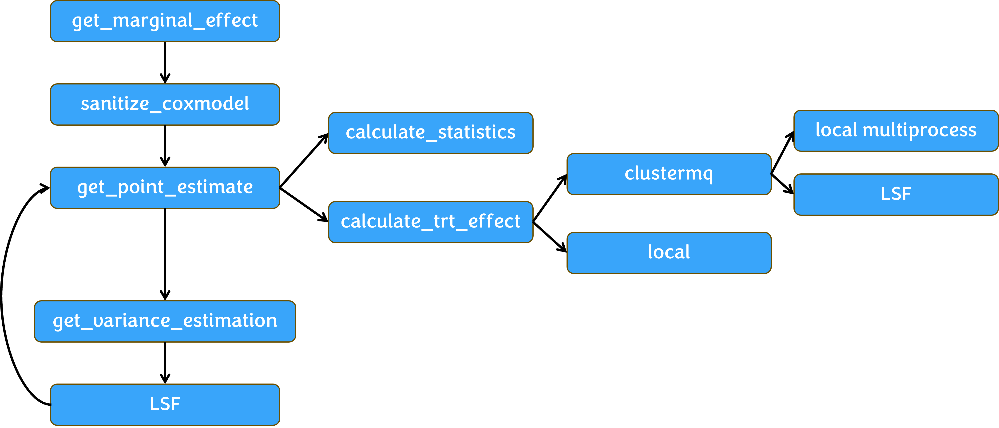

# bunsen: Marginal Estimation with Covariate Adjustment for Survival Endpoint in Clinical Trials

The **bunsen** package aims to provide an easy-to-use interface for estimating **marginal or unconditional Hazard Ratio (HR) and Restricted Mean Survival Time (RMST)** when adjusting prognostic covariates in clinical trials.

## Key features

We introduce **bunsen** package for marginal HR and RMST estimation and variance for time-to-event endpoints in clinical trials. We included multiple features in current package:

-   Marginal HR estimation
    -   Rcpp (C++) optimization
    -   ClusterMQ parallel computation
        -   Local multiprocess and multicores parallel computation for point estimate *(suggested)*
        -   LSF parallel computation for point estimate
        -   LSF and/or nested local multiprocess parallel computation for variance *(suggested)*
-   RMST estimation

### Marginal HR estimation framework


## Example

### Marginal point estimate and variance of HR for COX model

``` r
library(bunsen)

data('oak')

cox_event <- coxph(Surv(OS, os.status) ~ trt+btmb+pdl1, data=oak)

cox_censor <- coxph(Surv(OS, 1-os.status) ~trt+btmb+pdl1, data=oak)

get_marginal_effect(trt = 'trt',cox_event,cox_censor,M=10000,data=oak)

# Calculating point estimate in local clustermq using multiprocess...
# Starting 4 processes ...
# Running 4 calculations (12 objs/71.2 Kb common; 1 calls/chunk) ...
# Master: [11.2 secs 1.3% CPU]; Worker: [avg 17.3% CPU, max 305.1 Mb]                                                                           
# Calculating SE in clustermq using bootstrap N = 1000...
# Submitting 100 worker jobs (ID: cmq8170) ...
# Running 1,000 calculations (23 objs/218 Kb common; 1 calls/chunk) ...
# Master: [16.4 secs 9.5% CPU]; Worker: [avg 45.3% CPU, max 307.6 Mb]                                                                           
#       beta         se       2.5%      97.5% 
# -0.4502997  0.1041306 -0.6675942 -0.2524910 

```

### Marginal point estimate and variance of RMST for COX model

``` r
library(bunsen)

data('oak')

tau=26

time=oak$OS

status=oak$os.status

arm=oak$trt

covariates=oak[,c('btmb','pdl1')]

get_rmst_est(time, status, arm, covariates,tau,SE='delta')

# $RMST
# [1] 3.265971
# 
# $SE
#       SE     2.5%    97.5% 
# 0.716351 1.861923 4.670019 

set.seed(2024)

get_rmst_est(time, status, arm, covariates,tau,SE='boot',n.boot = 1000)

# $RMST
# [1] 3.265971
# 
# $SE
#       SE     2.5%    97.5% 
# 0.736598 1.800280 4.714082 
```
## Methodology

bunsen is developed based on three key papers:

-   HR: [Rhian Daniel et al. (2020)](https://onlinelibrary.wiley.com/doi/10.1002/bimj.201900297)
-   RMST: [Theodore Karrison et al. (2018)](https://journals.sagepub.com/doi/10.1177/1740774518759281)
-   Extension of above two methods: [Jiawei Wei et al. (2024)](https://www.tandfonline.com/doi/full/10.1080/19466315.2023.2292774)

## Package authors

-   Xinlei Deng (Maintainer)
-   Dominic Magirr
-   Craig Wang
-   Alexander Przybylski
-   Mark Baillie

## Acknowledgements

-   Jiawei Wei
-   Lukas Andreas Widmer
